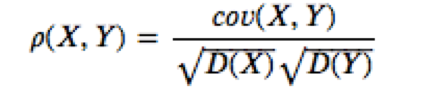
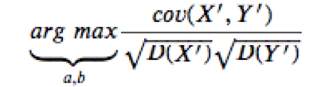
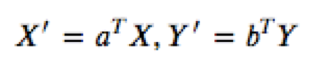
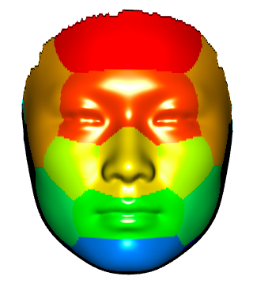
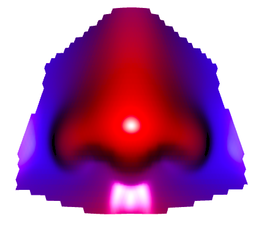

# Summary 

The **MAGPA** (multivariate analysis of genotype–phenotype association) is a package of multivariate correlation analysis and an interactive visualization tool for 3D image. This package was implemented for genetic association analysis of facial phenotypes and visualization related results. In addition, it can also be used in genome-wide association analysis of other multivariate phenotypes, especially three-dimensional image data. It can not only receive the prepared features, but also preprocess the features with principal component analysis and automatically select the number of variables. The genotype should be a SnpMatrix, which is a special object holding large arrays of single nucleotide polymorphism (SNP). Then，canonical correlation analysis (CCA)[@Härdle2007] is used to extract the linear combination of variables to maximize the correlation with each SNP. For the interactive visualization, the function *visual3d* is required to provide at least a reference of 3D image object and a vector, such as the phenotypic changes under different genotypes. It can draw a 3D object with different style and gradient colors.

# Statistical Methodology
CCA is a multivariate statistical method that reflects the overall correlation between two groups of variables by using the correlation between the pairs of comprehensive indicators, which is implemented in PLINK and has demonstrated its advantages in multivariable analysis of genotype-phenotype association. Here, briefly, X is the sample phenotypic matrix, the principle components of facial variations from each segment, and Y is the genotype of the sample. 𝜌(X,Y) is the canonical correlation (Formula 1).

 (1)

The target function of CCA is to maximize the 𝜌(X′,Y′) by optimizing the corresponding projection vector 𝑎 and 𝑏, called the canonical correlation coefficients between X and Y, respectively (Formula 2).

 ,  (2)


# Examples

In this example, the genotype data and phenotype data are used to demonstrate how to use the function *magpa* and show the one of the possible input to the function. The variable `geno` is a list with a SnpMatrix `genotypes` (2000 rows, 50 columns) and a data frame `map`. The variable `pheno` is a matrix (2000 rows, 300 columns) expanded by 2000 samples with 100 three-dimensional coordinate in each sample.

If your phenotype is pre-prepared, you can follow the step 3. Otherwise, you can follow the step 1, which set `pca` argument to `TRUE`. Or you can follow the step 2 to select features, and then follow the step 3.

## 1.Processing phenotype and multivariate association
The function *magpa* is performed multivariate analysis of genotype–phenotype association based on CCA, which calls the function “cca” to carry out the canonical correlation analysis and the function “F.test.cca” to test the statistical significance by employing Rao's statistic from the R package **yacca**[@Butts2009]. The first argument of *magpa* can be a file prefix name of plink[@Purcell2007] output (.bed, .bim, .fam), an object read by *read.plink* of the **snpStats**[@Sole2006] package, or a SnpMatrix. The second argument is the phenotypic matrix (rows are the number of samples, and columns are the number of features). 

```
data(geno);data(pheno)
gpa <- magpa(geno,pheno,pca = TRUE)
head(gpa)
```

## 2.Automatic extraction of the principal components
The function *pcapheno* is implemented to automatically extract the principal components from high-dimension data, which calls **paran** to performs Horn's parallel analysis[@Dinno2009] for evaluating the components retained in a principle component analysis. 

```
paral<- pcapheno(pheno)
new_pheno<- paral$pheno
head(new_pheno)
```

## 3.Multivariate association with prepared phenotype

The result in a matrix included SNP, CHR, position, MAF, canonical correlation, chisq, and pvalue. It can be used to draw QQ plot and Manhattan plot.

```
gpa<- magpa(geno,new_pheno)
head(gpa)
```

# Visualization for 3D Face

The function *visual3d* is an interactive graphing function based on the **rgl**[@Adler2003] package. This function is very flexible. The first argument is a reference of 3D image object, whose file (with `.obj` suffix) can be read by the *readobj* function. The second argument can be a vector or list. And the thrid argument is a vector of colors or a color palette, if it is not given, the default color palette will be used.
Two examples of using *visual3d* are as follows.You can see more in the help documentation.

    


# References
