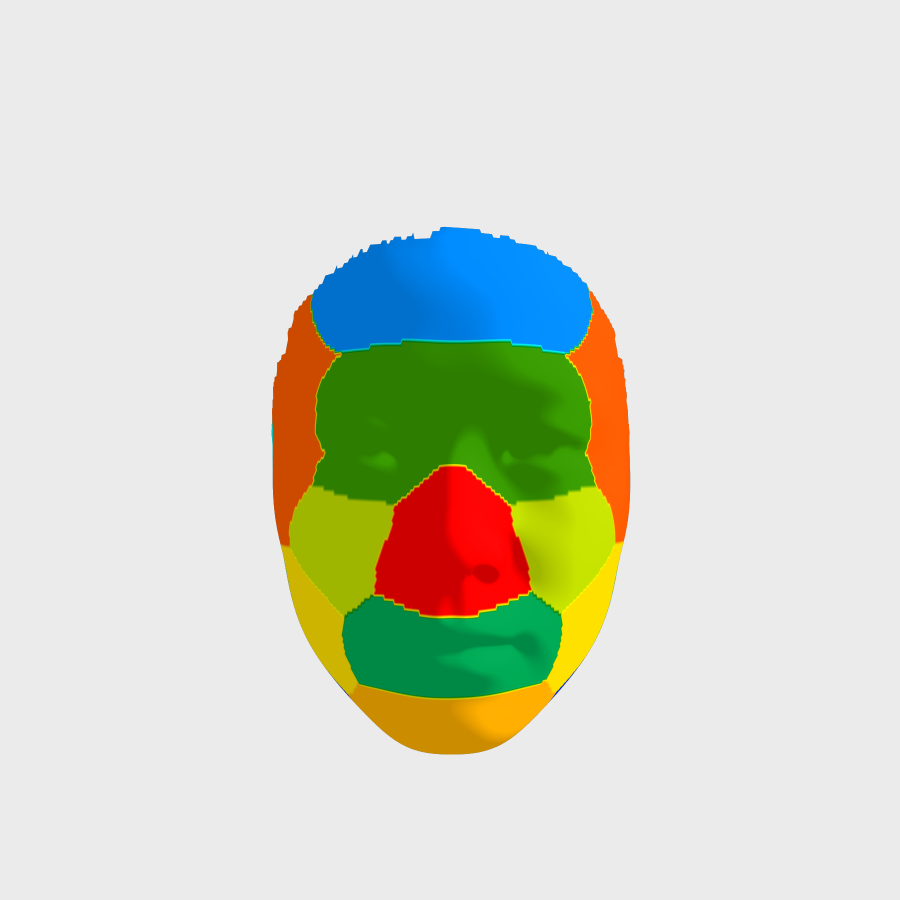

```{r setup, echo=FALSE, results="asis"}
source("setup.R")
knitr::opts_chunk$set(rgl.newwindow = TRUE)
set.seed(123)
```

# Introduction

The **MAGPA** (multivariate analysis of genotype–phenotype association) is a package of multivariate correlation analysis and an interactive visualization tool for 3D image. This package was implemented for genetic association analysis of facial phenotypes and visualization related results. In addition, it can also be used in genome-wide association analysis of other multivariate phenotypes, especially three-dimensional image data. It can not only receive the prepared features, but also preprocess the features with principal component analysis and automatically select the number of variables. The genotype should be a SnpMatrix, which is a special object holding large arrays of single nucleotide polymorphism (SNP). Then，canonical correlation analysis (CCA) is used to extract the linear combination of variables to maximize the correlation with each SNP. For the interactive visualization, the function *visual3d* is required to provide at least a reference of 3D image object and a vector, such as the phenotypic changes under different genotypes, which is highly customized. it can draw a 3D object with different style and gradient colors.

# Installation
The **MAGPA** package can be installed via GitHub. Befor installation, R or Rstudio should be installed on computer. To install the latest version of **MAGPA** through GitHub. Please run the following command in R.

```{r Installation, eval = FALSE}
if (!require("devtools"))
  install.packages("devtools")
devtools::install_github("changebio/MAGPA")
```

```{r}
library(MAGPA)
```

# Multivariate Analysis of Genotype–Phenotype Association

## About the Data

In this vignette we will look at a toy example, which includes genotype data in geno and phenotype data in pheno. the genotype data and phenotype data are used to demonstrate how to use the function *magpa* and show the one of the possible input to the function. The variable `geno` is a list with a SnpMatrix `genotypes` (2000 rows, 50 columns) and a data frame `map`.  The variable `pheno` is a matrix (2000 rows, 300 columns) expanded by 2000 samples with 100 three-dimensional coordinate in each sample.
```{r data}
data(geno)
str(geno)
```


```{r}
data(pheno)
str(pheno)
```

## How to use *magpa*

If your phenotype is pre-prepared, you can follow the step 2.2. Otherwise, you can follow the step 1, which set `pca` argument to `TRUE`. Or you can follow the step 2.1 to select features, and then follow the step 2.2.

### processing phenotype and multivariate association
the function *magpa* is performed multivariate analysis of genotype–phenotype association based on CCA, which calls *cca* in the **yacca** package to do canonical correlation analysis. The first argument of *magpa* can be a file prefix name of plink output (.bed, .bim, .fam), an object read by *read.plink* of the **snpStats** package, or a SnpMatrix. The second argument is the phenotypic matrix (rows are the number of samples, and columns are the number of features). 

```{r processing phenotype and multivariate association}
gpa <- magpa(geno,pheno,pca = TRUE)
head(gpa)
```

### automatic extraction of the principal components
The function *pcapheno* is implemented to automatically extract the principal components from high-dimension data, which calls *paran* to performs Horn's parallel analysis for evaluating the components retained in a principle component analysis. 
```{r automatic extraction of the principal components}
paral<- pcapheno(pheno)
new_pheno<- paral$pheno
head(new_pheno)
```

### multivariate association with prepared phenotype
```{r multivariate association with prepared phenotype}
gpa<- magpa(geno,new_pheno)
head(gpa)
```

The result in a matrix included SNP, CHR, position, MAF, canonical correlation, chisq, and pvalue. It can be used to draw QQ plot and Manhattan plot.

# Visualization for 3D Face

The function *visual3d* is an interactive graphing function based on the **rgl** package. the function is very flexible. The first argument is a reference of 3D image object, whose file (with `.obj` suffix) can be read by the *readobj* function. the second argument can be a vector or list. the thrid argument is a vector of colors or a color palette, if it is not given, the default color palette will be used.
Two examples of using *visual3d* are as follows.You can see more in the help documentation.

## example 1 : facial segmentation
Here, refface includes two object, a 3D reference face `ref.m` and a label vecter of facial segmentation `seg.idx`.
The human face was divided into 10 segments, as shown in the figure.

```{r, echo=FALSE, out.width = "400px"}

```

`ref.m` contains 32251 vertices, each of which is labeled in one of 10 categories. the information is in `seg.idx`.

```{r example 1 : facial segmentation}
data(refface)
ref.m <- refface$ref.m
seg.idx<- refface$seg.idx
visual3d(ref.m,seg.idx,col = colorbar(1:10,c("blue", "cyan","green", "yellow", "orange","red")))
rglwidget()
```

## example 2 : heatmap of nose region
The nose region was extracted from face by *Meshexract* function. Then, the volume of each tetrahedron made by tri-mesh and origin is calculated by *Meshvolume* function. *visual3d* shows the heatmap of the nose region.

```{r example 2 : heatmap of nose region, eval=TRUE, echo=T, message=FALSE, warning=FALSE}
clear3d() # Remove the earlier display
nose.idx<- which(seg.idx==10)
nose.m <- Meshextract(ref.m,nose.idx)
nose.vol<- Meshvolume(nose.m)
visual3d(nose.m,nose.vol)
rglwidget(reuse = FALSE)
```


# Sessioninfo

```{r sessionInfo, echo=FALSE}
sessionInfo()
```


